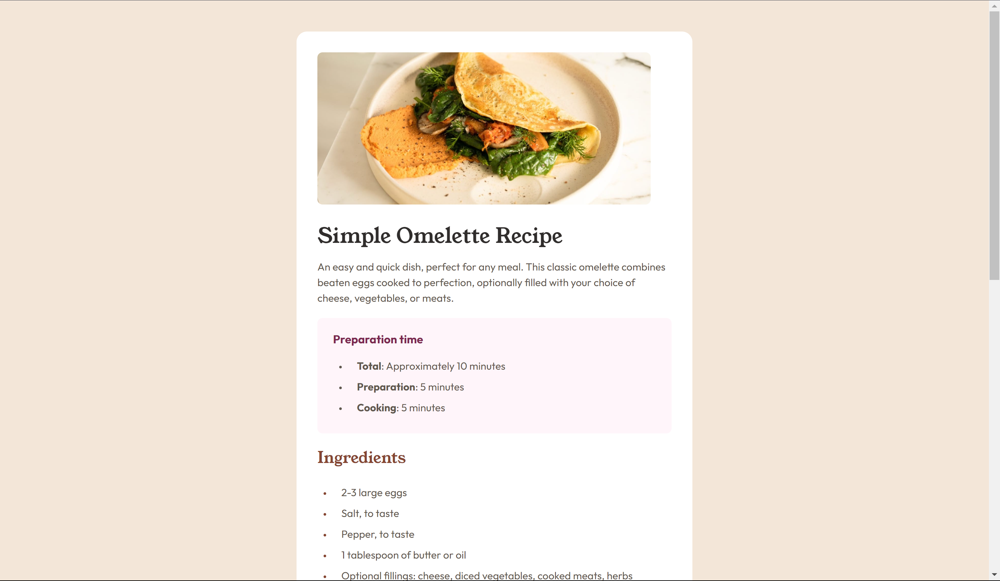
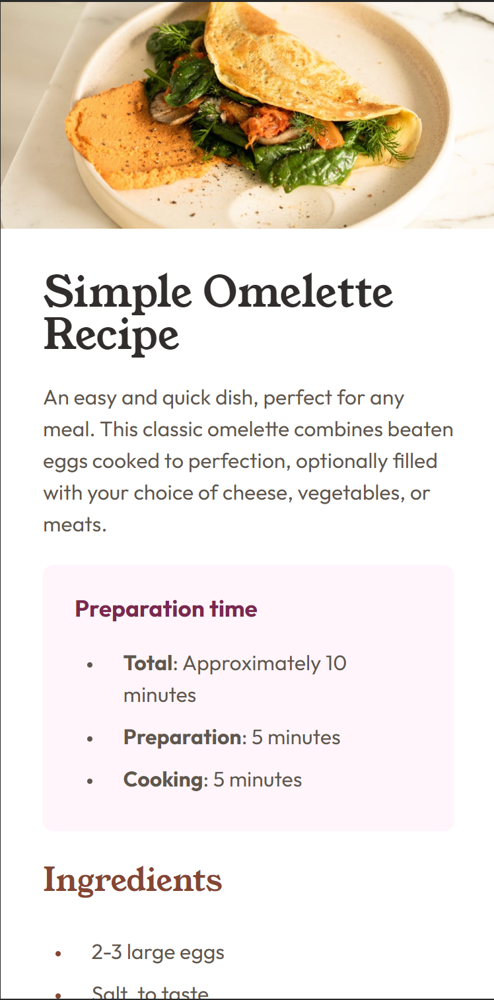

# Frontend Mentor - Recipe page solution

This is a solution to the [Recipe page challenge on Frontend Mentor](https://www.frontendmentor.io/challenges/recipe-page-KiTsR8QQKm). Frontend Mentor challenges help you improve your coding skills by building realistic projects. 

## Table of contents

- [Overview](#overview)
  - [Screenshot](#screenshot)
  - [Links](#links)
- [My process](#my-process)
  - [Built with](#built-with)
  - [Continued development](#continued-development)
- [Author](#author)

## Overview

### Screenshot

### Links

- Solution URL: [GitHub](https://github.com/rawrisotto/recipe-page-main/tree/main)
- Live Site URL: [Netlify](https://your-live-site-url.com)

## My process

### Built with

- Semantic HTML5 markup
- CSS custom properties
- CSS Grid

### Continued development

List marker not vertically centered for "Preparation Time" and "Ingredients" when in mobile view.

## Author

- Frontend Mentor - [@rawrisotto](https://www.frontendmentor.io/profile/rawrisotto)